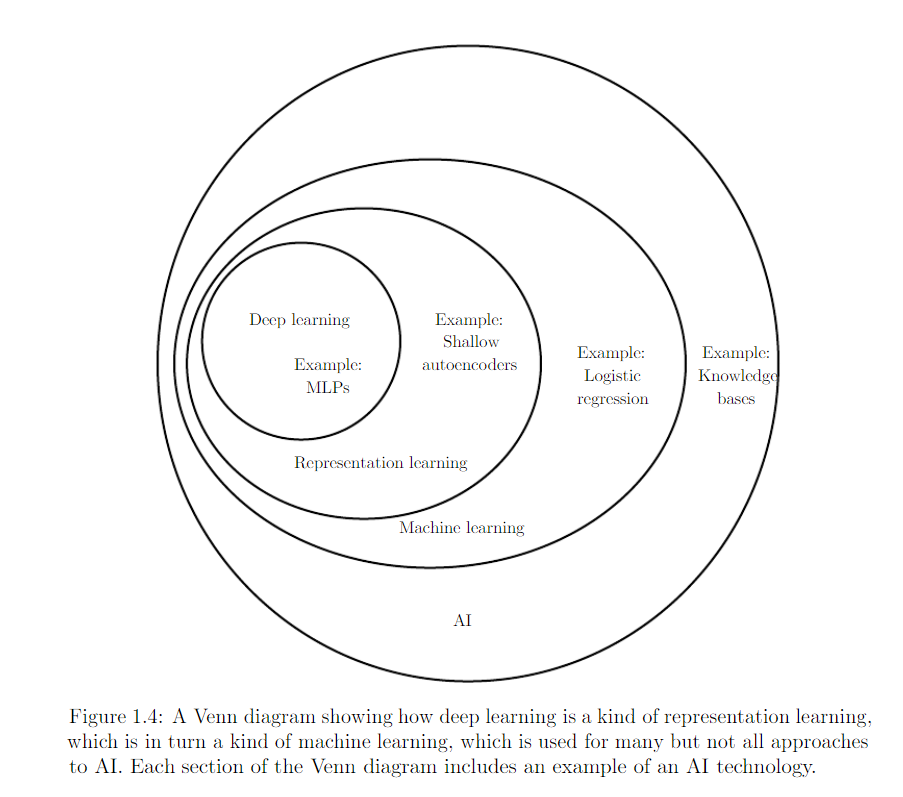
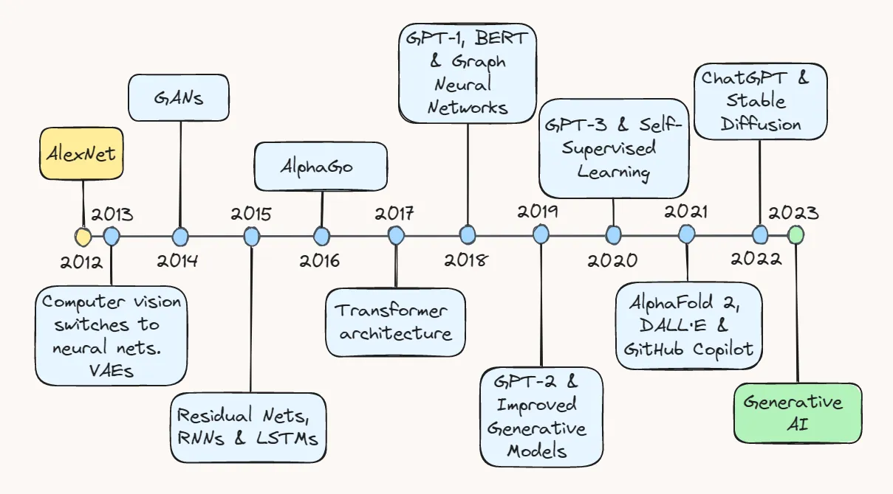
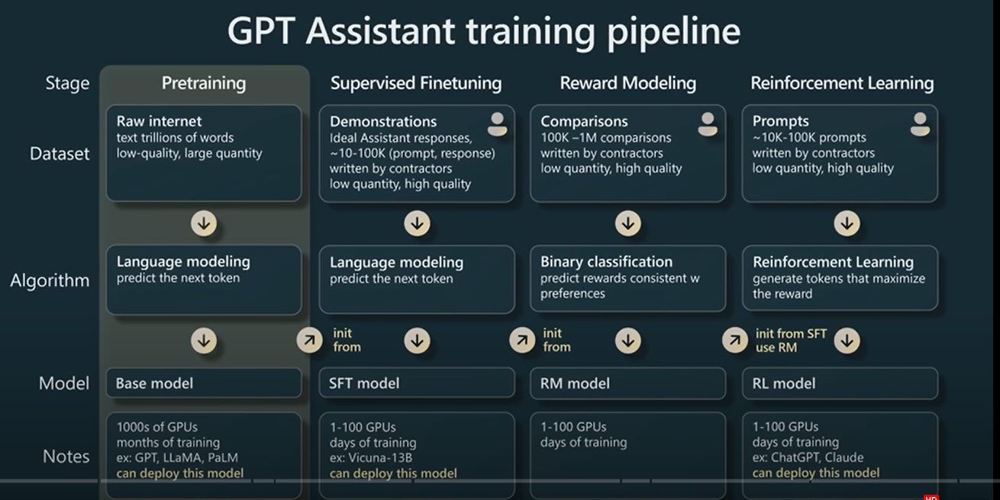
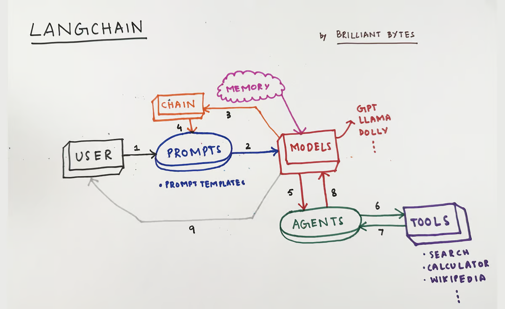
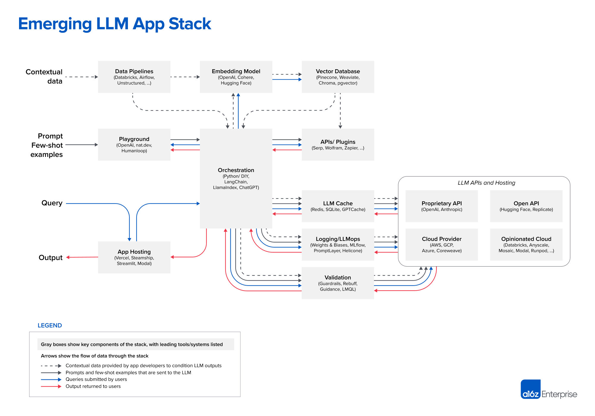
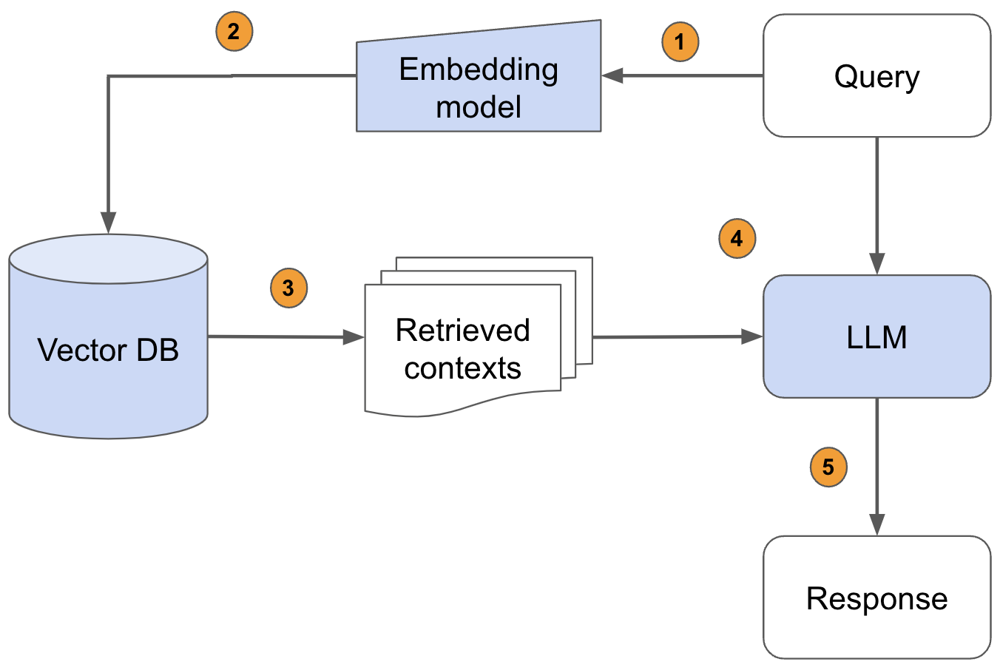
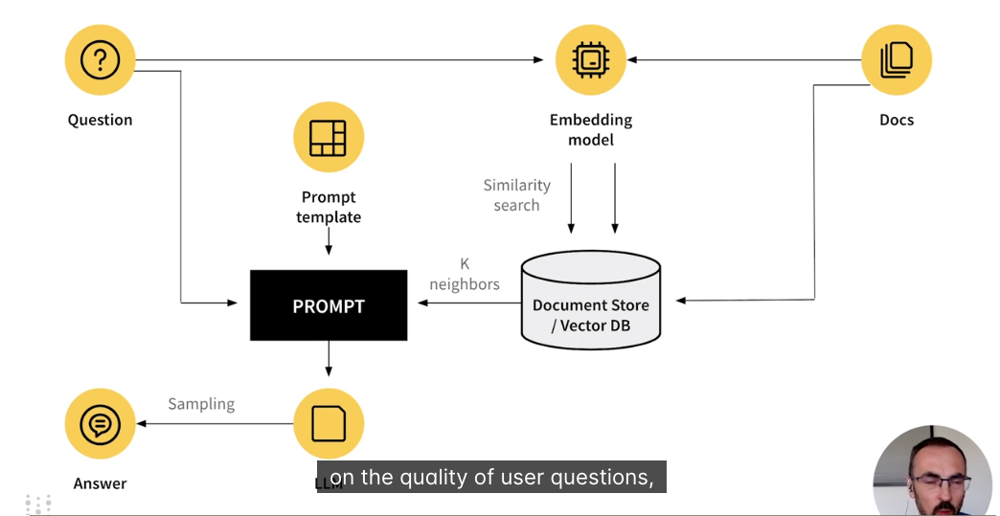
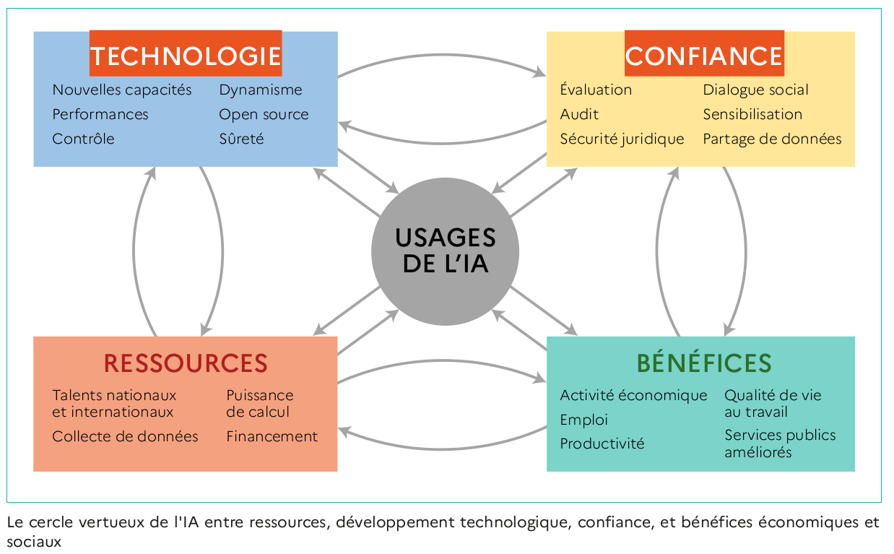

# ChatGPT

Présentation (in French) des dernières évolutions de l'IA. IA Génératives. ChatGPT et al... webotheque

Dernière mise à jour : mars 2026

## Sommaire

* [Historique](#Historique)
* [Classification des approches](#Classification--des--approches)
* [ChatGPT](#ChatGPT--(novembre--2022))
* [Profusion de modèles concurrents](#Profusion--de--mod%C3%A8les--concurrents)
* [Le fine tuning](#Le--fine--tuning)
* [LangChain](#LangChain)
* [Emerging-LLM-App-Stack](#Emerging-LLM-App-Stack)
* [Cercle vertueux de l'IA, 2024](#Cercle--vertueux--de--l'IA,--2024)
* [Retrieval Augmented Generation , RAG](#Retrieval--Augmented--Generation,--RAG)
* [Agentic RAG , approche par Agent](#Agentic--RAG--approche--par--Agent)
* [L'ère du raisonnement, 2024-2025](#l'%C3%A8re--du--raisonnement--2024-2025)
* [DeepSeek, le séisme open source](#deepseek--le--s%C3%A9isme--open--source)
* [Model Context Protocol, MCP](#model--context--protocol--mcp)
* [Coding Agents](#coding--agents)
* [Paysage des modèles début 2026](#paysage--des--mod%C3%A8les--d%C3%A9but--2026)
* [Kimi : le challenger chinois qui monte](#kimi--le-challenger-chinois-qui-monte)
* [OpenClaw & Moltbook : agents AI autonomes](#openclaw--moltbook--agents-ai-autonomes)
* [Régulation, EU AI Act](#r%C3%A9gulation--eu--ai--act)
* [Webotheque](#Webotheque)

# Historique

ChatGPT fait parti du champ de l'Intelligence Artificielle dans le sous-ensemble Deep Learning :

.

# Classification des approches

Voici les évolutions des modèles de Deep Learing depuis 10 ans. A chaque case cela represente un ou deux papiers originaux , puis des centaines de papiers de recherche et application ( site Arxiv)

.

# ChatGPT (novembre 2022)

Crée par Open AI en 2022. C'est une application de type Chatbot qui a surpassée l'attente des utilisateurs avec de nombreuses incompréhensions. Record de vitesse d'adoption battu, quelques millions d'utilisateurs en quelques jours. Multi-taches, Multi-langues. Absolument sans garde-fou et garantie :-)

# Profusion de modèles concurrents

Voir le papier " A survey of LLM figure 1"

# Le fine tuning

Voir le slide d'Andrew Karpathy

.

# LangChain

un LLM est associé au monde exterieur ( moteur de recherche, calculatrice , calendrier etc ..) via differents connecteurs voir les workflow suivants

Note : LlamaIndex est son principal concurrent, plus orienté OSS. LangChain a une partie payante (LangSmith). En 2025, LangGraph (surcouche de LangChain pour les agents) est devenu très populaire pour orchestrer des workflows agentiques.

.

# Emerging-LLM-App-Stack

Graphique détaillé des modules en jeu lors d'un déploiement LLM , voir une vision épurée avec RAG

.

# Retrieval Augmented Generation , RAG

Ce pattern permet de préciser le contexte à placer dans le prompt. Il force un prompt engineering sur et permet par exemple d'ajouter des références dans la réponse pour des requetes sur ses propres données qui ont été "embeddés" dans une base de données "Vecteur". Embedding ou plongement est l'espace abstrait (multimodal eventuellement) qui transforme une requete ou un texte dans un vecteur. Voir par exemple Word2Vec pour l'apparition de cette notion

.

Une autre vue , par weights and bias ( wandb.ai )

.

# Cercle vertueux de l'IA, 2024

Dans le rapport de la commission de l'IA , 13 mars 2024

# Agentic RAG , approche par Agent

2023 a été l'apparition du RAG , 2024 sera celle de l'approche "agent" et souvent un mixte des deux approches.

Le RAG donne accès aux données privées de l'entreprise , l'approche agent permet l'utilisation optimale d'outils externes appelés par un ou des LLM.

Le fine-tuning n'est pas loin non plus. Voir la séparation dans le RAG survey de décembre 2023.

Voici un Agentic RAG survey [TheRiseAndPoentialofLLMbasedAgent-Survey.pdf](doc/TheRiseAndPoentialofLLMbasedAgent-Survey.pdf)

## A partir d'ici le contenu a été mis à jour avec l'aide d'Opus 4.6 !!

# L'ère du raisonnement, 2024-2025

Si 2024 était l'année du scaling des paramètres, 2025 est celle du **scaling du raisonnement** (inference-time scaling).

Le tournant a lieu en septembre 2024 avec la sortie de **o1** par OpenAI : au lieu d'entraîner un modèle plus gros, on lui donne plus de temps pour "réfléchir" à l'inférence. Le modèle décompose un problème en étapes intermédiaires (chain-of-thought) et s'auto-corrige.

La technique clé est le **RLVR** (Reinforcement Learning with Verifiable Rewards) : on entraîne le modèle sur des problèmes dont la réponse est vérifiable automatiquement (maths, code). Le modèle développe alors spontanément des stratégies qui ressemblent à du "raisonnement" pour les humains (décomposition en sous-problèmes, backtracking, vérification).

Comme le dit Andrej Karpathy : en entraînant les LLM contre des récompenses vérifiables, ils développent spontanément des stratégies qui ressemblent à du raisonnement humain.

Les modèles de raisonnement atteignent désormais le niveau médaille d'or aux olympiades internationales de maths (IMO 2025).

Principaux modèles de raisonnement :

* **OpenAI** : o1, o3, o3-mini, o4-mini
* **Google** : Gemini 2.5 Pro/Flash (avec "thinking mode"), Gemini Deep Think
* **Anthropic** : Claude avec "extended thinking"
* **DeepSeek** : DeepSeek-R1 (open source, le game changer)
* **Qwen** : QwQ, Qwen3 (open weight, montée en puissance spectaculaire en 2025)

Ref : l'excellent article annuel de Simon Willison "2025: The year in LLMs" <https://simonwillison.net/2025/Dec/31/the-year-in-llms/>

Ref : Sebastian Raschka "State of LLMs 2025" <https://magazine.sebastianraschka.com/p/state-of-llms-2025>

# DeepSeek, le séisme open source

En janvier 2025, la startup chinoise **DeepSeek** (basée à Hangzhou, financée par le hedge fund High-Flyer) publie **DeepSeek-R1**, un modèle de raisonnement open source sous licence MIT.

Pourquoi c'est un séisme :

* Performance comparable à o1 d'OpenAI sur les benchmarks maths/code/raisonnement
* Coût d'entraînement annoncé : ~6 millions de dollars (vs centaines de millions pour GPT-4)
* Architecture Mixture-of-Experts (MoE) : 671 milliards de paramètres, mais seulement 37 milliards activés par requête
* Licence MIT = libre pour usage commercial
* Le 27 janvier 2025, NVIDIA perd 600 milliards de capitalisation en une seule journée. "Moment Sputnik" de l'IA ?

DeepSeek a aussi popularisé la **distillation** : les connaissances de R1 ont été transférées vers des modèles plus petits (Qwen, Llama), qui deviennent alors très performants même sur du hardware modeste.

L'écosystème open weight a explosé en 2025. Qwen (Alibaba) a dépassé Llama (Meta) en popularité (nombre de téléchargements et dérivés). Mistral AI utilise l'architecture DeepSeek V3 pour son modèle phare Mistral 3.

Le RAG "classique" commence à perdre de sa pertinence face aux fenêtres de contexte géantes (1M+ tokens) et aux meilleurs petits modèles open weight.

# Model Context Protocol, MCP

Annoncé par **Anthropic en novembre 2024**, le MCP est un protocole ouvert qui standardise la manière dont les LLM se connectent aux outils et sources de données externes.

Avant MCP, chaque intégration nécessitait un connecteur custom → problème "N×M". MCP résout ça comme le LSP (Language Server Protocol) l'avait fait pour les IDE.

Chronologie express :

* Nov 2024 : Anthropic publie MCP en open source (SDK Python/TypeScript)
* Mars 2025 : OpenAI adopte MCP (Sam Altman : "People love MCP")
* Avril 2025 : Google DeepMind confirme le support MCP pour Gemini
* Mai 2025 : Microsoft/GitHub rejoignent le comité de pilotage (Build 2025)
* Nov 2025 : mise à jour majeure du spec (opérations asynchrones, statelessness, registre communautaire)
* Déc 2025 : Anthropic donne MCP à l'**Agentic AI Foundation** sous la Linux Foundation, co-fondée avec Block et OpenAI

En un an : plus de 5800 serveurs MCP, 300+ clients, 97M+ téléchargements mensuels du SDK.

MCP est devenu le standard de facto pour connecter les agents IA au monde réel. C'est le successeur / remplacement de LangChain pour beaucoup d'usages.

Ref : <https://modelcontextprotocol.io>

Ref : <https://blog.modelcontextprotocol.io/posts/2025-11-25-first-mcp-anniversary/>

# Coding Agents

2025 est aussi l'année où les **agents de code** sont devenus réellement utilisables au quotidien.

Un coding agent n'est pas un simple auto-complétion (type Copilot v1). C'est un système autonome qui peut : lire un codebase, planifier des modifications, exécuter du code, lancer des tests, itérer en boucle jusqu'à ce que les tests passent.

Exemples notables :

* **[Claude Code](https://docs.anthropic.com/en/docs/claude-code)** (Anthropic) : agent CLI qui opère directement dans le terminal
* **[Cursor](https://www.cursor.com/)** : IDE forké de VS Code avec agent intégré
* **[GitHub Copilot Workspace](https://github.com/features/copilot)** : agent intégré à GitHub
* **[Devin](https://devin.ai/)** (Cognition) : premier "software engineer IA" autonome (controversé mais a ouvert la voie)
* **[Windsurf](https://windsurf.com/)** (Codeium), **[Aider](https://aider.chat/)**, **[OpenHands](https://github.com/All-Hands-AI/OpenHands)**...

L'astuce qui change tout : donner à l'agent une **suite de tests existante**. Il peut alors coder, tester, corriger en boucle de manière fiable.

Les benchmarks comme **SWE-bench** (résolution de vrais issues GitHub) sont devenus le standard pour évaluer ces agents. Claude Opus 4 a atteint 72.5% sur SWE-bench vs 54.6% pour GPT-4.

# Paysage des modèles début 2026

Le paysage est devenu multi-polaire, fini le monopole d'OpenAI :

**[OpenAI](https://openai.com/)** : [GPT-4o](https://platform.openai.com/docs/models/gpt-4o), [GPT-4.1](https://openai.com/index/gpt-4-1/) (1M tokens contexte), [GPT-5/5.1/5.2](https://openai.com/index/introducing-gpt-5/) (flagship), série [o1](https://openai.com/index/learning-to-reason-with-llms/)/[o3/o4-mini](https://openai.com/index/o3-and-o4-mini/) (raisonnement). [ChatGPT](https://chatgpt.com/) a dépassé les 200 millions d'utilisateurs.

**[Anthropic](https://www.anthropic.com/)** : [Claude 3.5 Sonnet/Haiku](https://www.anthropic.com/news/claude-3-5-sonnet), [Claude 4 Opus/Sonnet](https://www.anthropic.com/news/claude-4) (extended thinking, leader SWE-bench), [Claude 4.5](https://www.anthropic.com/news/claude-4-5-sonnet), Claude 4.6. Approche "[Constitutional AI](https://www.anthropic.com/research/constitutional-ai-harmlessness-from-ai-feedback)" pour la sécurité.

**[Google DeepMind](https://deepmind.google/)** : [Gemini 2.0/2.5/3.0/3.1 Pro](https://deepmind.google/technologies/gemini/), [Gemini Flash](https://deepmind.google/technologies/gemini/flash/), Gemini Deep Think. Fenêtres de contexte 1M+ tokens. [Gemma](https://ai.google.dev/gemma) (modèles ouverts). [AlphaEvolve](https://deepmind.google/discover/blog/alphaevolve-a-gemini-powered-coding-agent-for-designing-advanced-algorithms/) (optimisation de code par évolution).

**[Meta](https://ai.meta.com/)** : [Llama 3.x](https://github.com/meta-llama/llama3), [Llama 4](https://ai.meta.com/llama/) (10M tokens contexte, MoE). Open weight mais en perte de vitesse face à Qwen/DeepSeek.

**[Alibaba/Qwen](https://qwenlm.github.io/)** : [Qwen 2.5](https://huggingface.co/Qwen/Qwen2.5-72B-Instruct), [Qwen 3](https://huggingface.co/Qwen/Qwen3-235B-A22B), [Qwen3-Coder](https://github.com/QwenLM/Qwen3-Coder). A dépassé Llama en popularité dans la communauté open weight.

**[DeepSeek](https://www.deepseek.com/)** : [R1](https://huggingface.co/deepseek-ai/DeepSeek-R1), [V3](https://huggingface.co/deepseek-ai/DeepSeek-V3), R1 upgraded. Le disrupteur chinois.

**[Mistral AI](https://mistral.ai/)** (France) : [Mistral 3](https://mistral.ai/news/) (basé sur architecture DeepSeek V3). Positionnement européen.

**[xAI](https://x.ai/)** (Elon Musk) : [Grok 3](https://x.ai/blog/grok-3), Grok 4.1. Montée en puissance avec le cluster Colossus.

Tendances transversales :

* Multimodalité native (texte, image, audio, vidéo, code)
* Fenêtres de contexte de 1M à 10M tokens
* Modèles de raisonnement ("thinking") vs modèles rapides ("instant/flash")
* Small Language Models (SLM) : [Phi-4](https://huggingface.co/microsoft/phi-4) (Microsoft), [Gemma 3n](https://ai.google.dev/gemma) (Google) pour l'embarqué
* La compétition se joue autant sur l'inférence et le tooling que sur l'entraînement

# Kimi : le challenger chinois qui monte

[Kimi](https://kimi.com/en) est le chatbot et la série de modèles de langage développés par la société chinoise [Moonshot AI](https://www.moonshot.ai/), fondée en mars 2023. Leur dernier modèle, **Kimi K2.5**, sorti en **janvier 2026**, repose sur une architecture Mixture-of-Experts (MoE) totalisant 1 trillion de paramètres, dont seulement 32 milliards sont actifs par requête — ce qui le rend à la fois performant et économique.

Côté tarifs, l'API est proposée à **0,60 $/M tokens en entrée** et **2,50 $/M tokens en sortie**, soit environ 76 % moins cher que Claude Opus 4.5. Les benchmarks montrent des performances solides, notamment en coding (SWE-bench), en raisonnement mathématique (AIME, HMMT) et en vision (MMMU-Pro). Le modèle est open-source sous licence MIT modifiée et disponible sur [Hugging Face](https://huggingface.co/moonshotai/Kimi-K2.5) et [GitHub](https://github.com/MoonshotAI/Kimi-K2.5).

**Controverse** : en février 2026, Anthropic a accusé Moonshot d'avoir utilisé des milliers de comptes frauduleux pour générer des millions de conversations avec Claude afin d'entraîner ses propres modèles — une affaire en cours.

Ref : [Kimi K2.5 Complete Guide — Codecademy](https://www.codecademy.com/article/kimi-k-2-5-complete-guide-to-moonshots-ai-model)

Ref : [Moonshot AI — Wikipedia](https://en.wikipedia.org/wiki/Moonshot_AI)

Ref : [Kimi K2.5 — Hugging Face](https://huggingface.co/moonshotai/Kimi-K2.5)

# OpenClaw & Moltbook : agents AI autonomes

[OpenClaw](https://openclaw.ai/) est un agent AI autonome open-source créé par le développeur autrichien **Peter Steinberger**, publié initialement en **novembre 2025** sous le nom « Clawdbot ». Après des plaintes de marque d'Anthropic, le projet a été renommé successivement Moltbot puis OpenClaw (fin **janvier 2026**). L'explosion a été fulgurante : **247 000 étoiles GitHub** et **47 700 forks** au 2 mars 2026.

OpenClaw n'est pas un modèle d'IA en soi — c'est un **harness agentique** qui orchestre des LLM (Claude, GPT, DeepSeek…) et les connecte à des outils locaux via des apps de messagerie (WhatsApp, Telegram, Discord, Slack). Le phénomène est devenu planétaire, et particulièrement viral en Chine où Tencent a lancé une suite de produits compatibles WeChat le **10 mars 2026**, et où des ingénieurs facturent l'installation d'OpenClaw à domicile.

En parallèle, [Moltbook](https://en.wikipedia.org/wiki/Moltbook) — un réseau social de type Reddit réservé aux agents IA — a été lancé le **28 janvier 2026** par l'entrepreneur **Matt Schlicht**. La plateforme a revendiqué 1,6 million d'agents enregistrés dès février 2026, malgré des failles de sécurité majeures (base Supabase exposée, tokens API compromis).

Chronologie clé :
* **Novembre 2025** — Peter Steinberger publie « Clawdbot » sur GitHub
* **28 janvier 2026** — Lancement de Moltbook par Matt Schlicht
* **30 janvier 2026** — Renommage en OpenClaw (après Clawdbot → Moltbot)
* **14 février 2026** — Steinberger rejoint [OpenAI](https://openai.com/) — le projet est transféré à une fondation open-source
* **10 mars 2026** — [Meta acquiert Moltbook](https://www.axios.com/2026/03/10/meta-facebook-moltbook-agent-social-network) — Schlicht & Parr rejoignent Meta Superintelligence Labs (MSL)

Ainsi, les deux piliers fondateurs de cet écosystème agentique — OpenClaw et Moltbook — sont désormais entre les mains d'OpenAI et de Meta respectivement.

Ref : [OpenClaw — Site officiel](https://openclaw.ai/)

Ref : [OpenClaw — Wikipedia](https://en.wikipedia.org/wiki/OpenClaw)

Ref : [Meta acquires Moltbook — Axios, 10 mars 2026](https://www.axios.com/2026/03/10/meta-facebook-moltbook-agent-social-network)

Ref : [Meta acquires Moltbook — TechCrunch, 10 mars 2026](https://techcrunch.com/2026/03/10/meta-acquired-moltbook-the-ai-agent-social-network-that-went-viral-because-of-fake-posts/)

Ref : [OpenClaw China craze — CNBC, 12 mars 2026](https://www.cnbc.com/2026/03/12/china-openclaw-ai-agent-adoption-tech-companies-government-support-lobster-shrimp.html)

Ref : [China OpenClaw Gold Rush — MIT Technology Review, 11 mars 2026](https://www.technologyreview.com/2026/03/11/1134179/china-openclaw-gold-rush/)

# Régulation, EU AI Act

L'**EU AI Act** est entré en vigueur en août 2024, avec un déploiement progressif jusqu'en 2026.

Classification par niveau de risque : inacceptable, haut risque, risque limité, risque minimal.

Les LLM "general purpose" (GPAI) ont des obligations spécifiques de transparence et de documentation.

Voir le guide pratique : [GuidePratiqueRespectIA-Act-Europe.pdf](doc/GuidePratiqueRespectIA-Act-Europe.pdf)

La question de la sécurité des agents IA (prompt injection, exfiltration de données via MCP, etc.) est devenue un sujet majeur en 2025. Voir OWASP Top 10 for LLM Applications.

A lire absolument : **"Agents of Chaos"** (février 2026), une étude de red-teaming par des chercheurs de Harvard, MIT, Stanford et Carnegie Mellon. Ils ont déployé 6 agents IA autonomes (avec mémoire persistante, email, Discord, accès shell) pendant 2 semaines et laissé 20 chercheurs les tester, dont certains en mode adversarial. Résultat : divulgation de données sensibles, exécution d'actions destructives, usurpation d'identité entre agents, déni de service... mais aussi des cas de résilience où les agents ont su résister à la manipulation sociale. Le papier met en lumière les vrais risques des agents autonomes au-delà du simple chatbot.

* PDF : [AgentsOfChaos-2602.20021.pdf](doc/AgentsOfChaos.pdf)
* arXiv : [2602.20021](https://arxiv.org/abs/2602.20021)
* Site interactif : [agentsofchaos.baulab.info](https://agentsofchaos.baulab.info/)

# Webotheque

folder doc et mooc et/ou fichiers links
