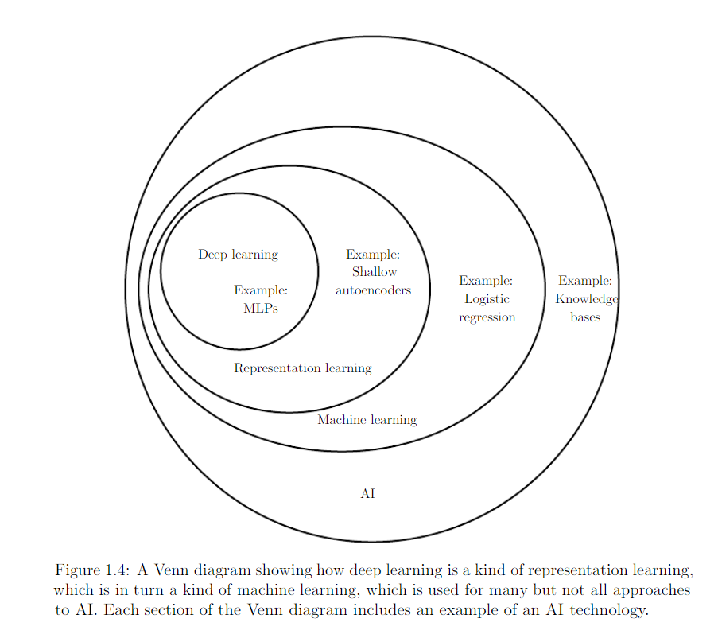

# ChatGPT
Présentation (in French) des dernières évolutions de l'IA. IA Génératives. ChatGPT et al... webotheque

## Sommaire
- [Historique](#Historique)
- [Classification des approches](#Classification--des--approches)
- [ChatGPT](#ChatGPT--(novembre--2022))
- [Profusion de modèles concurrents](#Profusion--de--modèles--concurrents)
- [Le fine tuning](#Le--fine--tuning)
- [LangChain](#LangChain)
- [Emerging-LLM-App-Stack](#Emerging-LLM-App-Stack)
- [Cercle vertueux de l'IA, 2024](#Cercle--vertueux--de--l'IA,--2024)
- [Retrieval Augmented Generation , RAG](#Retrieval--Augmented--Generation,--RAG)
- [Agentic RAG , approche par Agent](#Agentic--RAG--approche--par--Agent)

# Historique

ChatGPT fait parti du champ de l'Intelligence Artificielle dans le sous-ensemble Deep Learning :

.

# Classification des approches

Voici les évolutions des modèles de Deep Learing depuis 10 ans. A chaque case cela represente un ou deux papiers originaux , puis des centaines de papiers de recherche et application ( site Arxiv)

.
 # ChatGPT (novembre 2022)

Crée par Open AI en 2022. C'est une application de type Chatbot qui a surpassée l'attente des utilisateurs avec de nombreuses incompréhensions. Record de vitesse d'adoption battu, quelques millions d'utilisateurs en quelques jours. Multi-taches, Multi-langues. Absolument sans garde-fou et garantie :-)

 # Profusion de modèles concurrents

Voir le papier " A survey of LLM figure 1"

 # Le fine tuning

Voir le slide d'Andrew Karpathy

.

# LangChain

  un LLM est associé au monde exterieur ( moteur de recherche, calculatrice , calendrier etc ..) via differents connecteurs voir les workflow suivants

  Il faudrait aussi ajouter un paragraphe sur LlamaIndex son principal concurrent, peut-être plus OSS , LangChain a une partie payante.

.

 # Emerging-LLM-App-Stack

   Graphique détaillé des modules en jeu lors d'un déploiement LLM , voir une vision épurée avec RAG

.

# Retrieval Augmented Generation , RAG
  
  Ce pattern permet de préciser le contexte à placer dans le prompt. Il force un prompt engineering sur et permet par exemple d'ajouter des références dans la réponse pour des requetes sur ses propres données qui ont été "embeddés" dans une base de données "Vecteur". Embedding ou plongement est l'espace abstrait (multimodal eventuellement) qui transforme une requete ou un texte dans un vecteur. Voir par exemple Word2Vec pour l'apparition de cette notion

.  

Une autre vue , par weights and bias ( wandb.ai )

.  

# Cercle vertueux de l'IA, 2024
Dans le rapport de la commission de l'IA , 13 mars 2024

# Agentic RAG , approche par Agent

  2023 a été l'apparition du RAG , 2024 sera celle de l'approche "agent" et souvent un mixte des deux approches.

  Le RAG donne accès aux données privées de l'entreprise , l'approche agent permet l'utilisation optimale d'outils externes appelés par un ou des LLM.

  Le fine-tuning n'est pas loin non plus. Voir la séparation dans le RAG survey de décembre 2023.

  Voici un Agentic RAG survey [TheRiseAndPoentialofLLMbasedAgent-Survey.pdf](doc/TheRiseAndPoentialofLLMbasedAgent-Survey.pdf)

  

 
# Webotheque 

folder doc et mooc et/ou fichiers links
 
